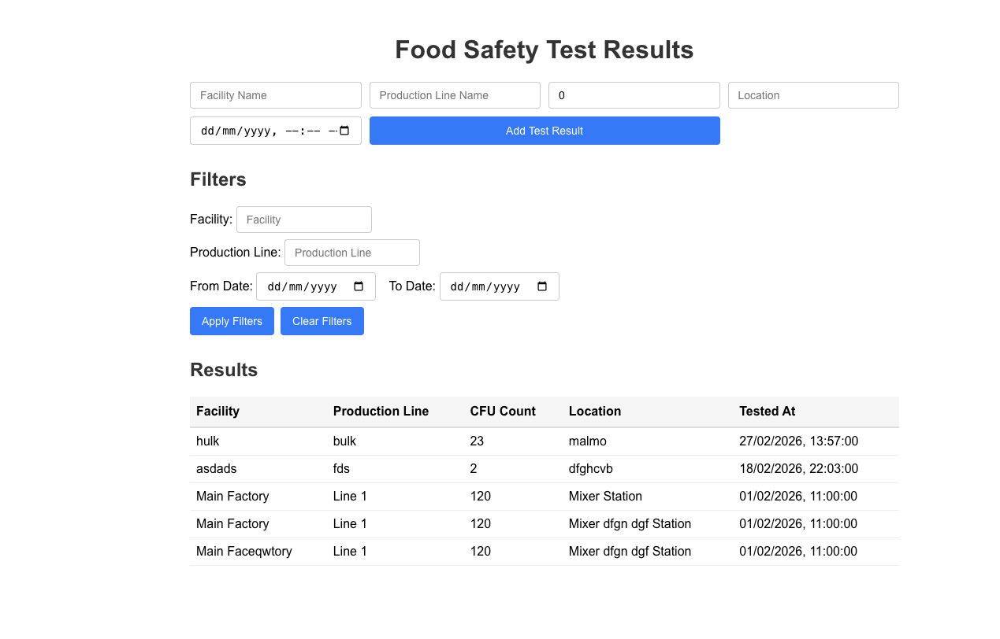

# Food Safety Frontend

This is a frontend for the Food Safety Data Service. It allows users to:

- View test results
- Add new test results
- Filter results by facility, production line, and date range

## Tech Stack

- React.js
- TypeScript
- Axios for HTTP requests

## Prerequisites

- npm
- Backend API running (e.g., http://localhost:3000)

## Environment Variables

Create a `.env` file in the project root:

```
REACT_APP_BACKEND_URL=http://localhost:3000
```

## Available Scripts

In the project directory, you can run:

### `npm install`

Installs all dependencies.

### `npm start`

Runs the app in development mode.  
Open [http://localhost:3001](http://localhost:3001) to view it in the browser.

## Configuration

If your backend API is running on a different port or host, update the API base URL in .env

## Screenshots


